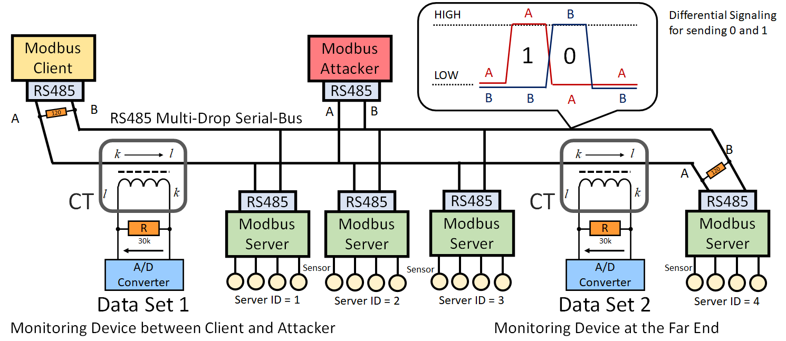

# Data Set for Modbus/RS-485 Industrial Control Network Security Research

Figure: Monitoring of the current flow on RS-485 line “A” by attaching a current transformer (CT). We generate Data Set 1 by attaching a CT between the Client and Attacker, and Data Set 2 by attaching it at the far end. Here, RS-485 multi-drop serial-bus network exchanges messages on two electronically common lines called “A” and “B” with differential voltage signals[1].

## Overview

RS-485 is a multi-drop serial-bus used worldwide as a de-facto standard in many industrial control systems such as power grid, factories, transportations, solar power plants, and building automation. The attack to the fieldbus may cause catastrophic disaster in the physical world, which should be avoided to secure our lives.

This dataset is captured on a RS-485 testbed illustrated as the figure above. RS-485 connects multiple devices with lines “A” and “B”, which usually come with a twisted-pair cable. A device in the network transmits a binary bit “0” or “1” with differential signaling. For example, “0” is modulated with (LOW, HIGH) for (A, B), whereas it is (HIGH, LOW) for “1”. This allows serial communication among the nodes on the network. Communication lines A and B are physically shared among all the devices. Thus, all the devices sense the same voltage level, meaning that sequences of data are always broadcasted. Upper-layer protocols such as Modbus, BACnet, and Profibus define who to receive the payload and who to respond to the message. The Modbus protocol used in our experiment is also a de-facto standard on multi-drop serial-buses and is used worldwide in building automation, factory automation, and many other fields. Typically, they assume multiple end devices, which act as a “Server,” and a single control device, which acts as a “Client”. When the client transmits a request to the RS-485 network (such as “I want to read two bytes from the register of address 20H on Server 01H”), all servers receive the request, but only the corresponding server (in this case, Server 01H) transmits the response to the RS-485 network. Here, “H” indicates a hexadecimal value. Similarly, this response is received by all the devices, but only the client reads its payload.

To detect these attacks, this dataset captured the “analog values” of the current flow of RS-485 line “A” or “B” by using a current transformer (CT) as depicted in the Figure. As RS-485 has 120Ω termination resistors at both ends of the bus, if the voltage between line “A” and “B” becomes 3V, about 25mA current shall flow on the line. Then, for example, with a winding rate of 1:3000 for CT, and a 30kΩ burden resistor between CT output pins, we get 250mV between the terminals of the burden resistor. By using a 10-bit A/D converter (the value range is from 0 to 1023) with a 3.3V reference voltage, this 250mV is observed as a difference of about 80. To clearly capture the waveform in the case of 9600bps, we recommend 30kHz for the sampling rate of the A/D converter.

There are several choices regarding the attachment of CT. It can be attached to line “B” instead of “A”. The direction of CT (shown by k→l in the figure) can be also reversed. It can be attached around the Client or at the far end of the network. In this study, we consider two monitoring cases for simplicity. The one is to attach a CT near the Client and the other is to attach a CT at the far end as the figure. We call Data Set 1 (DS1 for short) for the collected data with the former configuration and Data Set 2 (DS2) with the latter configuration.

As for the detail, please refer to the paper [1].

## DataSet Files
 1. 0101-ct_m-s1_at_s2.csv
 2. 0102-ct_s3-s4_at_s2.csv
 3. 0201-ct_m-s1_at_s2.csv
 4. 0202-ct_s3-s4_at_s2.csv
 5. 0301-ct_m-s1_at_s2.csv
 6. 0302-ct_s3-s4_at_s2.csv
 7. 0401-ct_m-s1_at_s2.csv
 8. 0402-ct_s3-s4_at_s2.csv
 9. 0501-ct_m-s1_at_s2.csv
 10. 0502-ct_s3-s4_at_s2.csv

## File Name Rule
 XXYY-ct_A-B_at_C.csv

 ### XX: Attack Scenario
  01: Spoofing Attack  
  02: Random Collision Attack  
  03: Horizontal Scan Attack  
  04: Vertical Scan Attack  
  05: Evil-Twin Attack  
  
 ## YY: Index Numbers
  01: DataSet 1  (Monitoring near the Client)  
  02: DataSet 2  (Monitoring at the far end)  
  
 ## A-B: CT's connection point, one of {m-s1, s1-s2, s2-s3, s3-s4}
  If DataSet 1, "A-B" is "m-s1".  
  If DataSet 2, "A-B" is "s3-s4".
  
 ## C: Attack point, one of {m, s1, s2, s3, s4}
  If "C"="s2", the attacker is located at Server ID=2

## Data Format

Each row of the CSV file is formatted as follows:

seq_id | x0 | x1 | ... | x382 | label
:---: | :---: | :---: | :---: | :---: | :---: 

Please see the example directory for further understanding.

## Explanations of Each Attack Scenario

* Spoofing Attack (XX=01)

An attacker transmits jamming signals on the communication line after reading the first four bytes of a request from the Client. Here, the first four bytes contain the Server ID and register address, and the attacker can identify the spoofing target. The jamming signals break the later part of the request frame including the CRC16 checksum area. Then, the legitimate server just considers that it has received a broken message and does nothing. Instead, the attacker transmits its spoofed response message as the legitimate Server.

* Random Collision Attack (XX=02)

An attacker transmits jamming signals on the communication line at random when it observes a legitimate signal on the line. This destroys the request frames from the Client, and the communication between the Client and the Server would be denied.

* Horizontal Scan Attack (XX=03)

An attacker requests Servers on the network by changing the Server ID from ID=01H to 7FH, expecting some form of response, including an error response, from the specified Server if it exists.

* Vertical Scan Attack (XX=04)

An attacker requests to read from a wider range of register addresses instead of a smaller set of register addresses one by one. The purpose of this attack is to explore data – which are usually not used in system operation and are not exchanged on the communication line but still exist on the Server. 

* Evil Twin Attack (XX=05)

An attacker sends requests on behalf of the legitimate Client. The requests are identical to those of the legitimate Client. However, accepting and responding to the attacker’s requests should be avoided, and these kinds of anomalous requests should be detected.

## References

Please cite the first paper (i.e., [1]) when you publish your research with this dataset.

[1] Hideya Ochiai , Md Delwar Hossain, Pawissakan Chirupphapa, Youki Kadobayashi, Hiroshi Esaki, "Modbus/RS-485 Attack Detection on Communication Signals with Machine Learning", IEEE Communications Magazine, 2023 (to be announced).

[2] Pawissakan Chirupphapa, Md Delwar Hossain, Hiroshi Esaki, and Hideya Ochiai, "Unsupervised Anomaly Detection in RS-485 Traffic using Autoencoders with Unobtrusive Measurement", IEEE International Performance, Computing, and Communications Conference (IPCCC), 2022.

[3] Md Delwar Hossain, Hideya Ochiai, Tatsuya Arisawa, Youki Kadobayashi, "Smart Meter RS-485 Spoofing Attack Detection by LSTM Deep Learning Approach", IEEE Swiss Conference on Data Science (SDS), 2022.
